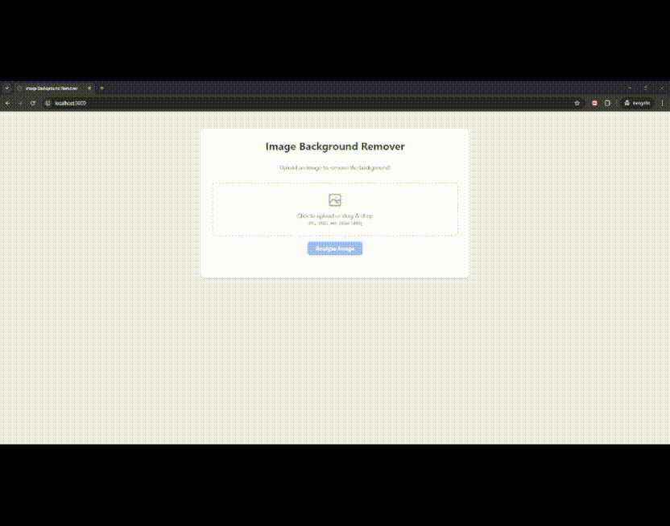

# Image Background Remover


Image Background Remover streamlines the process of isolating foregrounds from images with impressive accuracy and speed. Its clean, intuitive interface makes background removal a breeze. This project is actively under development, continually refining the balance between output quality and processing time.

## Installation

1. Clone the repository:
   ```bash
   git clone https://github.com/mntadros/image-background-remover.git
   ```
2. Change into the project directory:
   ```bash
   cd image-background-remover
   ```
3. Install dependencies:
   ```bash
   npm install
   ```

## Usage

Start the application:
```bash
npm start
```
Then open your browser at `http://localhost:3000` to begin removing backgrounds.

## Demo


